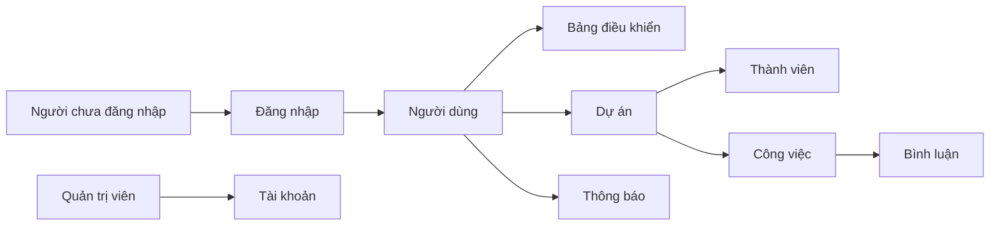

# Đặc tả yêu cầu phần mềm (SRS)

| Mục | Nội dung |
| --- | --- |
| Tên hệ thống | Hệ thống Quản lý Dự án |
| Môn | Triển khai và Quản trị Hệ thống Phần mềm |
| Đề | Đề 14 |
| Mã | PMS-ICTU |
| Phiên bản | 1.1 |
| Ngày | 08/10/2026 |
| Sinh viên | [Họ và tên] — MSSV: [........] — Lớp: [........] |
| Giảng viên | [Họ và tên giảng viên] |

## 1. Giới thiệu

### 1.1. Mục đích

Tài liệu mô tả yêu cầu nghiệp vụ của Hệ thống Quản lý Dự án, đề 14 môn Triển khai và Quản trị Hệ thống Phần mềm. Phần triển khai, giám sát và chấm điểm nằm ở [yêu cầu đề tài](00-yeu-cau-de-tai.md).

Hệ thống là ứng dụng web nội bộ giúp tạo dự án, phân công thành viên, theo dõi công việc và xem tiến độ. Toàn bộ ứng dụng chạy trên máy cá nhân thông qua Docker Desktop. Nhân viên không tự đăng ký; quản trị viên cấp từng tài khoản.

### 1.2. Phạm vi

Trong phạm vi phiên bản 1.0:

- Đăng nhập và phân quyền. Tài khoản do quản trị viên cấp, không có đăng ký công khai.
- Quản lý người dùng ở mức quản trị.
- Quản lý dự án và thành viên dự án.
- Quản lý công việc theo trạng thái.
- Bình luận trên công việc và nhật ký hoạt động.
- Bảng điều khiển tiến độ và thông báo trong hệ thống.
- Đóng gói bằng Docker Compose: Nginx reverse proxy, PostgreSQL, pgAdmin, Prometheus, Grafana, Loki và Promtail.

Ngoài phạm vi phiên bản 1.0:

- Ứng dụng di động riêng.
- Thanh toán, chấm công, quản lý ngân sách.
- Tích hợp email, Slack, Google Calendar.
- Triển khai lên máy chủ đám mây hoặc Kubernetes.
- Chat thời gian thực và gọi video.
- Đăng ký công khai.
- Đăng nhập một lần qua thư mục nhân sự của công ty (SSO, LDAP, Active Directory). Phiên bản 1.0 thay bằng tài khoản cục bộ do quản trị viên cấp.

### 1.3. Định nghĩa và từ viết tắt

| Thuật ngữ | Nghĩa |
| --- | --- |
| PMS | Project Management System — Hệ thống Quản lý Dự án |
| Dự án | Một hạng mục công việc có mục tiêu, thời gian và nhóm thực hiện |
| Công việc | Hạng mục cần hoàn thành trong một dự án |
| PM | Người quản lý dự án |
| SRS | Software Requirements Specification |
| API | Giao diện lập trình ứng dụng, dạng REST/JSON |
| JWT | JSON Web Token, mã thông báo phiên đăng nhập |

### 1.4. Tài liệu tham chiếu

- Bộ tài liệu trong thư mục `docs/` của kho mã PMS-ICTU.
- Docker Compose Specification (Compose file phiên bản 3.9).
- PostgreSQL 16 Documentation.

## 2. Mô tả tổng quan

### 2.1. Bối cảnh

Nhóm làm việc trong một đơn vị cần một nơi chung để biết dự án nào đang mở, ai phụ trách việc gì và việc nào sắp đến hạn. Danh tính nhân viên do đơn vị quản lý: quản trị viên tạo tài khoản và giao mật khẩu tạm, nhân viên đăng nhập rồi đổi mật khẩu. Phiên bản đồ án chạy cục bộ: người dùng mở trình duyệt tới cổng do Docker Desktop xuất ra, không cần cài riêng Node.js hay PostgreSQL trên máy.

### 2.2. Tác nhân

| Tác nhân | Mô tả |
| --- | --- |
| Người chưa đăng nhập | Chỉ đăng nhập bằng tài khoản đã được cấp. Không tạo tài khoản mới. |
| Thành viên | Người dùng đã đăng nhập, tham gia dự án được mời. |
| Quản lý dự án | Người tạo hoặc được gán quyền quản lý một dự án. |
| Quản trị viên | Người vận hành toàn hệ thống: người dùng, vai trò, mọi dự án. |

Một tài khoản có đúng một vai trò hệ thống: `ADMIN` hoặc `USER`. Trong từng dự án, người dùng có một vai trò dự án: `OWNER`, `MANAGER` hoặc `MEMBER`.

### 2.3. Chức năng khái quát

### 2.4. Lớp người dùng và đặc quyền

Mọi tài khoản đang hoạt động đều tạo được dự án mới và trở thành `OWNER` của dự án đó. Các dòng còn lại xét theo vai trò trong một dự án đã có.

| Hành động | Thành viên | Quản lý dự án | Quản trị viên |
| --- | --- | --- | --- |
| Xem dự án mình tham gia | Có | Có | Có, kể cả dự án không tham gia |
| Tạo dự án mới | Có | Có | Có |
| Sửa thông tin dự án | Không | Có, với dự án mình quản lý | Có |
| Thêm hoặc gỡ thành viên | Không | Có | Có |
| Tạo và sửa mọi công việc trong dự án | Không | Có | Có |
| Cập nhật công việc được gán cho mình | Có | Có | Có |
| Bình luận công việc mình thấy | Có | Có | Có |
| Khóa tài khoản, gán vai trò hệ thống | Không | Không | Có |
| Cấp tài khoản mới | Không | Không | Có |

Người tạo dự án nhận vai trò `OWNER`. `OWNER` và `MANAGER` cùng được gọi là quản lý dự án trong các yêu cầu bên dưới. Chỉ `OWNER` hoặc quản trị viên được xóa dự án và chuyển quyền sở hữu.

### 2.5. Môi trường vận hành

| Thành phần | Yêu cầu |
| --- | --- |
| Máy chủ chạy ứng dụng | Docker Desktop trên Windows, macOS hoặc Linux |
| Trình duyệt | Chrome, Edge hoặc Firefox bản hiện hành |
| Cơ sở dữ liệu | PostgreSQL 16 và pgAdmin 4 trong container |
| Cổng website | `http://localhost:8080` qua Nginx |

### 2.6. Ràng buộc thiết kế

- Giao diện và thông báo nghiệp vụ dùng tiếng Việt.
- Mật khẩu được băm trước khi lưu; hệ thống không lưu mật khẩu dạng rõ.
- Phiên đăng nhập dùng JWT, thời hạn 8 giờ.
- Dữ liệu PostgreSQL nằm trên Docker volume để còn sau khi tắt container.
- Cổng cơ sở dữ liệu không publish ra máy host trong cấu hình mặc định.

## 3. Yêu cầu chức năng

Mỗi yêu cầu có mã, mô tả và tiêu chí chấp nhận.

### 3.1. Xác thực

| Mã | Yêu cầu | Tiêu chí chấp nhận |
| --- | --- | --- |
| FR-AUTH-01 | Không có đăng ký công khai | Giao diện không có form đăng ký. Không có API để khách tự tạo tài khoản |
| FR-AUTH-02 | Đăng nhập bằng email và mật khẩu đã được cấp | Đúng thông tin thì trả JWT và thông tin người dùng; sai thì báo lỗi, không lộ mật khẩu |
| FR-AUTH-03 | Đăng xuất | Phía giao diện xóa token; các lời gọi sau đó bị từ chối nếu không còn token hợp lệ |
| FR-AUTH-04 | Đổi mật khẩu khi đã đăng nhập | Mật khẩu hiện tại đúng và mật khẩu mới đạt quy tắc thì cập nhật thành công, đồng thời tắt cờ buộc đổi mật khẩu |
| FR-AUTH-05 | Chặn truy cập khi chưa đăng nhập hoặc tài khoản bị khóa | API nghiệp vụ trả 401 hoặc 403 tương ứng |
| FR-AUTH-06 | Buộc đổi mật khẩu tạm ở lần đăng nhập đầu | Khi cờ buộc đổi mật khẩu đang bật, người dùng chỉ gọi được API hồ sơ và đổi mật khẩu; các API nghiệp vụ khác trả 403 |

Quy tắc mật khẩu: ít nhất 8 ký tự, có chữ và số.

### 3.2. Quản trị người dùng

| Mã | Yêu cầu | Tiêu chí chấp nhận |
| --- | --- | --- |
| FR-USER-01 | Quản trị viên xem danh sách người dùng, tìm theo tên hoặc email | Danh sách có phân trang, mỗi trang tối đa 20 bản ghi |
| FR-USER-02 | Khóa và mở khóa tài khoản | Tài khoản khóa không đăng nhập được; quản trị viên không tự khóa chính mình |
| FR-USER-03 | Gán vai trò hệ thống `ADMIN` hoặc `USER` | Vai trò mới có hiệu lực ở lần gọi API tiếp theo |
| FR-USER-04 | Cấp tài khoản nhân viên: họ tên, email, mật khẩu tạm | Chỉ quản trị viên. Email chưa tồn tại thì tạo vai trò `USER`, trạng thái đang hoạt động, và bật cờ buộc đổi mật khẩu |

### 3.3. Quản lý dự án

| Mã | Yêu cầu | Tiêu chí chấp nhận |
| --- | --- | --- |
| FR-PRJ-01 | Tạo dự án: tên, mô tả, ngày bắt đầu, ngày kết thúc dự kiến | Người tạo trở thành `OWNER`; tên không rỗng, ngày kết thúc không trước ngày bắt đầu |
| FR-PRJ-02 | Xem danh sách dự án | Thành viên chỉ thấy dự án mình tham gia; quản trị viên thấy mọi dự án |
| FR-PRJ-03 | Xem chi tiết dự án | Có thông tin chung, thành viên, số công việc theo trạng thái |
| FR-PRJ-04 | Cập nhật thông tin dự án | Chỉ quản lý dự án hoặc quản trị viên |
| FR-PRJ-05 | Đổi trạng thái dự án: `PLANNING`, `ACTIVE`, `ON_HOLD`, `COMPLETED` | Khi dự án `COMPLETED`, không tạo thêm công việc mới |
| FR-PRJ-06 | Xóa dự án | Chỉ `OWNER` hoặc quản trị viên; xóa kèm thành viên, công việc, bình luận của dự án đó |

### 3.4. Thành viên dự án

| Mã | Yêu cầu | Tiêu chí chấp nhận |
| --- | --- | --- |
| FR-MEM-01 | Thêm thành viên bằng email tài khoản đã tồn tại | Người được thêm nhận vai trò `MEMBER` hoặc `MANAGER` và có thông báo |
| FR-MEM-02 | Gỡ thành viên khỏi dự án | Không gỡ được `OWNER` nếu chưa chuyển quyền sở hữu |
| FR-MEM-03 | Đổi vai trò thành viên trong dự án | `OWNER` hoặc quản trị viên đổi được `MEMBER` và `MANAGER` |

### 3.5. Công việc

| Mã | Yêu cầu | Tiêu chí chấp nhận |
| --- | --- | --- |
| FR-TASK-01 | Tạo công việc: tiêu đề, mô tả, ưu tiên, hạn hoàn thành, người thực hiện | Công việc mới có trạng thái `TODO` |
| FR-TASK-02 | Sửa nội dung công việc | Quản lý dự án sửa mọi trường; thành viên chỉ sửa công việc được gán cho mình, trừ việc đổi người thực hiện |
| FR-TASK-03 | Đổi trạng thái theo thứ tự `TODO` → `IN_PROGRESS` → `REVIEW` → `DONE` | Cho phép đưa lùi một bước; ghi nhật ký mỗi lần đổi |
| FR-TASK-04 | Lọc và sắp xếp công việc | Lọc theo trạng thái, người thực hiện, ưu tiên; sắp theo hạn hoàn thành |
| FR-TASK-05 | Xóa công việc | Chỉ quản lý dự án hoặc quản trị viên |

Ưu tiên nhận một trong các giá trị: `LOW`, `MEDIUM`, `HIGH`, `URGENT`.

### 3.6. Bình luận và nhật ký

| Mã | Yêu cầu | Tiêu chí chấp nhận |
| --- | --- | --- |
| FR-CMT-01 | Thêm bình luận trên công việc mà người dùng được xem | Nội dung từ 1 đến 2000 ký tự; hiển thị người viết và thời điểm |
| FR-CMT-02 | Xem nhật ký hoạt động của dự án | Ghi các sự kiện: tạo/sửa/xóa dự án, thêm/gỡ thành viên, tạo/đổi trạng thái/xóa công việc |

### 3.7. Bảng điều khiển và thông báo

| Mã | Yêu cầu | Tiêu chí chấp nhận |
| --- | --- | --- |
| FR-DASH-01 | Bảng điều khiển cá nhân | Hiện số dự án đang tham gia, số việc của tôi theo trạng thái, việc đến hạn trong 7 ngày |
| FR-DASH-02 | Tiến độ một dự án | Phần trăm công việc `DONE` trên tổng công việc của dự án |
| FR-NOTI-01 | Tạo thông báo trong hệ thống | Khi được thêm vào dự án, được gán công việc, hoặc công việc của mình bị đổi trạng thái bởi người khác |
| FR-NOTI-02 | Xem và đánh dấu đã đọc thông báo | Người dùng chỉ thấy thông báo của chính mình |

## 4. Yêu cầu phi chức năng

| Mã | Nhóm | Yêu cầu |
| --- | --- | --- |
| NFR-01 | Hiệu năng | Với dữ liệu đồ án (tối đa 50 người dùng, 100 dự án, 2.000 công việc), API danh sách trả kết quả trong dưới 1 giây trên máy phát triển |
| NFR-02 | Bảo mật | Mật khẩu băm bằng bcrypt; API nghiệp vụ yêu cầu JWT; kiểm tra quyền trên máy chủ, không chỉ ẩn nút trên giao diện |
| NFR-03 | Toàn vẹn | Xóa và cập nhật tuân ràng buộc khóa ngoại; không để công việc trỏ tới dự án đã mất |
| NFR-04 | Sẵn sàng triển khai | Lệnh `docker compose up -d --build` dựng website, PostgreSQL, pgAdmin, Nginx, Prometheus, Grafana, Loki và Promtail |
| NFR-05 | Bền vững dữ liệu | Tắt và bật lại cụm container không làm mất dữ liệu đã ghi |
| NFR-06 | Khả năng sử dụng | Luồng chính (đăng nhập, mở dự án, tạo việc, đổi trạng thái) thực hiện được không cần tài liệu ngoài màn hình |
| NFR-07 | Nhật ký vận hành | API ghi log mức info cho yêu cầu và mức error cho lỗi không xử lý được |
| NFR-08 | Ngôn ngữ | Nhãn, thông báo lỗi nghiệp vụ và trang trống dùng tiếng Việt |
| NFR-09 | Khả năng kiểm thử | Mỗi yêu cầu chức năng có ít nhất một ca kiểm thử tương ứng trong kế hoạch kiểm thử |

## 5. Yêu cầu giao diện

- Ứng dụng một trang, điều hướng bên trái: Bảng điều khiển, Dự án, Thông báo.
- Màn hình công việc của một dự án trình bày theo bốn cột trạng thái.
- Màu ưu tiên: thấp (xám), trung bình (xanh), cao (cam), khẩn cấp (đỏ).
- Form báo lỗi ngay dưới trường sai.
- Độ rộng dùng được từ 1280px; dưới 768px vẫn đọc được danh sách và form, cho phép cuộn ngang bảng cột.

## 6. Yêu cầu dữ liệu nghiệp vụ

- Email là duy nhất, không phân biệt hoa thường.
- Tên dự án từ 3 đến 150 ký tự.
- Tiêu đề công việc từ 3 đến 200 ký tự.
- Ngày lưu theo kiểu ngày; thời điểm tạo và cập nhật lưu theo UTC, hiển thị theo giờ địa phương của trình duyệt.
- Không cho hai bản ghi thành viên cùng một cặp người dùng và dự án.

## 7. Giả định và phụ thuộc

- Docker Desktop đã cài và engine đang chạy trước khi nghiệm thu triển khai.
- Phiên bản 1.0 dùng một cơ sở dữ liệu duy nhất, không tách đọc/ghi.
- Không có máy chủ SMTP; thông báo chỉ hiện trong ứng dụng.
- Tài khoản quản trị đầu tiên được tạo bằng biến môi trường khi API khởi động lần đầu, nếu chưa có tài khoản `ADMIN` nào.
- Mật khẩu tạm được quản trị viên giao trực tiếp cho nhân viên trong phiên bản 1.0, vì hệ thống không gửi email.
