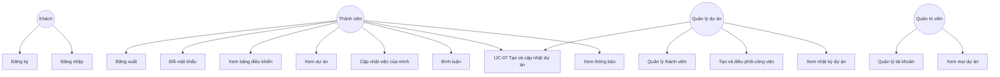

# Đặc tả ca sử dụng

| Mục | Nội dung |
| --- | --- |
| Hệ thống | PMS-ICTU |
| Phiên bản | 1.0 |
| Liên kết | [SRS](01-srs-dac-ta-yeu-cau.md) |

## 1. Sơ đồ ca sử dụng

Quản lý dự án kế thừa các ca của thành viên trong những dự án mình tham gia. Quản trị viên thực hiện được các ca quản lý trên mọi dự án, kèm ca quản trị tài khoản.

## 2. Danh mục ca sử dụng

| Mã | Tên | Tác nhân chính | Yêu cầu SRS |
| --- | --- | --- | --- |
| UC-01 | Đăng ký | Khách | FR-AUTH-01 |
| UC-02 | Đăng nhập | Khách | FR-AUTH-02, FR-AUTH-05 |
| UC-03 | Đăng xuất | Người đã đăng nhập | FR-AUTH-03 |
| UC-04 | Đổi mật khẩu | Người đã đăng nhập | FR-AUTH-04 |
| UC-05 | Xem bảng điều khiển | Thành viên | FR-DASH-01, FR-DASH-02 |
| UC-06 | Xem danh sách và chi tiết dự án | Thành viên | FR-PRJ-02, FR-PRJ-03 |
| UC-07 | Tạo và cập nhật dự án | Người đã đăng nhập khi tạo; quản lý dự án khi sửa | FR-PRJ-01, FR-PRJ-04, FR-PRJ-05, FR-PRJ-06 |
| UC-08 | Quản lý thành viên dự án | Quản lý dự án | FR-MEM-01, FR-MEM-02, FR-MEM-03 |
| UC-09 | Tạo và điều phối công việc | Quản lý dự án | FR-TASK-01, FR-TASK-04, FR-TASK-05 |
| UC-10 | Cập nhật công việc được gán | Thành viên | FR-TASK-02, FR-TASK-03 |
| UC-11 | Xem nhật ký dự án | Quản lý dự án | FR-CMT-02 |
| UC-12 | Bình luận công việc | Thành viên | FR-CMT-01 |
| UC-13 | Xem và đọc thông báo | Thành viên | FR-NOTI-01, FR-NOTI-02 |
| UC-14 | Quản lý tài khoản hệ thống | Quản trị viên | FR-USER-01, FR-USER-02, FR-USER-03 |
| UC-15 | Giám sát toàn bộ dự án | Quản trị viên | FR-PRJ-02 |

## 3. Đặc tả chi tiết

### UC-01. Đăng ký

| Mục | Nội dung |
| --- | --- |
| Tác nhân | Khách |
| Tiền điều kiện | Khách đang ở trang đăng ký |
| Hậu điều kiện | Có tài khoản `USER` đang hoạt động |
| Luồng chính | 1. Khách nhập họ tên, email, mật khẩu, xác nhận mật khẩu. 2. Hệ thống kiểm tra định dạng và độ mạnh mật khẩu. 3. Hệ thống kiểm tra email chưa tồn tại. 4. Hệ thống lưu tài khoản và chuyển tới trang đăng nhập. |
| Ngoại lệ | Email đã tồn tại: báo "Email đã được sử dụng". Mật khẩu không khớp hoặc chưa đủ quy tắc: giữ form, chỉ rõ trường sai. |

### UC-02. Đăng nhập

| Mục | Nội dung |
| --- | --- |
| Tác nhân | Khách |
| Tiền điều kiện | Tài khoản đã tồn tại |
| Hậu điều kiện | Trình duyệt giữ JWT; người dùng vào bảng điều khiển |
| Luồng chính | 1. Nhập email và mật khẩu. 2. Hệ thống đối chiếu tài khoản đang hoạt động. 3. Cấp JWT hạn 8 giờ. 4. Mở bảng điều khiển. |
| Ngoại lệ | Sai email hoặc mật khẩu: một thông báo chung "Email hoặc mật khẩu không đúng". Tài khoản bị khóa: "Tài khoản đang bị khóa". |

### UC-05. Xem bảng điều khiển

| Mục | Nội dung |
| --- | --- |
| Tác nhân | Thành viên |
| Tiền điều kiện | Đã đăng nhập |
| Hậu điều kiện | Không đổi dữ liệu |
| Luồng chính | 1. Hệ thống đếm dự án người dùng đang tham gia. 2. Đếm công việc được gán theo bốn trạng thái. 3. Liệt kê việc đến hạn trong 7 ngày tới, sắp hạn gần nhất lên trước. 4. Hiện các thẻ số liệu và danh sách. |
| Ngoại lệ | Chưa tham gia dự án nào: hiện trạng thái trống và lời hướng dẫn chờ được mời hoặc, với quản lý, nút tạo dự án. |

### UC-07. Tạo và cập nhật dự án

| Mục | Nội dung |
| --- | --- |
| Tác nhân | Người đã đăng nhập khi tạo; quản lý dự án hoặc quản trị viên khi sửa, đổi trạng thái, xóa |
| Tiền điều kiện | Đã đăng nhập; với sửa/xóa/đổi trạng thái thì có quyền trên dự án đó |
| Hậu điều kiện | Dự án được tạo, sửa, đổi trạng thái hoặc xóa; có bản ghi nhật ký |
| Luồng chính — tạo | 1. Chọn Tạo dự án. 2. Nhập tên, mô tả, ngày bắt đầu, ngày kết thúc. 3. Hệ thống lưu trạng thái `PLANNING` và gán người tạo làm `OWNER`. 4. Mở trang chi tiết dự án. |
| Luồng phụ — đổi trạng thái | Chọn trạng thái mới trong `PLANNING`, `ACTIVE`, `ON_HOLD`, `COMPLETED`. |
| Luồng phụ — xóa | Xác nhận bằng cách gõ lại tên dự án. Hệ thống xóa dự án và dữ liệu phụ thuộc. |
| Ngoại lệ | Ngày kết thúc trước ngày bắt đầu. Tên ngắn hơn 3 ký tự. Thành viên thường sửa hoặc xóa dự án: từ chối 403. Dự án `COMPLETED`: từ chối tạo công việc mới. |

### UC-08. Quản lý thành viên dự án

| Mục | Nội dung |
| --- | --- |
| Tác nhân | Quản lý dự án, quản trị viên |
| Tiền điều kiện | Dự án tồn tại và người dùng có quyền quản lý |
| Hậu điều kiện | Danh sách thành viên thay đổi; người được thêm có thông báo |
| Luồng chính — thêm | 1. Nhập email. 2. Chọn vai trò `MEMBER` hoặc `MANAGER`. 3. Hệ thống tìm tài khoản đang hoạt động. 4. Tạo bản ghi thành viên và thông báo. |
| Luồng phụ — gỡ | Chọn thành viên không phải `OWNER`, xác nhận, gỡ khỏi dự án. Công việc người đó đang nhận được giữ nguyên, người thực hiện để trống. |
| Luồng phụ — chuyển sở hữu | `OWNER` chọn một `MANAGER` và xác nhận. Vai trò cũ của owner thành `MANAGER`. |
| Ngoại lệ | Email không tồn tại. Người đã ở trong dự án. Gỡ owner khi chưa chuyển quyền. |

### UC-09. Tạo và điều phối công việc

| Mục | Nội dung |
| --- | --- |
| Tác nhân | Quản lý dự án, quản trị viên |
| Tiền điều kiện | Dự án không ở trạng thái `COMPLETED` |
| Hậu điều kiện | Công việc mới trạng thái `TODO`, hoặc công việc bị xóa; có nhật ký |
| Luồng chính | 1. Mở bảng công việc của dự án. 2. Nhập tiêu đề, mô tả, ưu tiên, hạn, người thực hiện thuộc dự án. 3. Lưu. 4. Thẻ xuất hiện ở cột Cần làm. 5. Người được gán nhận thông báo. |
| Ngoại lệ | Người được gán không thuộc dự án. Tiêu đề không đạt độ dài. Hạn hoàn thành trước ngày bắt đầu dự án. |

### UC-10. Cập nhật công việc được gán

| Mục | Nội dung |
| --- | --- |
| Tác nhân | Thành viên được gán việc |
| Tiền điều kiện | Công việc gán cho chính người dùng, hoặc người dùng là quản lý dự án |
| Hậu điều kiện | Nội dung hoặc trạng thái thay đổi; có nhật ký nếu đổi trạng thái |
| Luồng chính | 1. Mở thẻ việc. 2. Sửa mô tả hoặc chuyển trạng thái sang bước kế hoặc lùi một bước. 3. Lưu. 4. Nếu người khác đổi trạng thái việc của thành viên, thành viên nhận thông báo. |
| Ngoại lệ | Thành viên đổi người thực hiện hoặc xóa việc: từ chối. Nhảy cóc qua hai trạng thái: từ chối. |

Thứ tự trạng thái: `TODO`, `IN_PROGRESS`, `REVIEW`, `DONE`.

### UC-12. Bình luận công việc

| Mục | Nội dung |
| --- | --- |
| Tác nhân | Thành viên của dự án |
| Tiền điều kiện | Được xem công việc |
| Hậu điều kiện | Bình luận gắn với công việc, người viết và thời điểm |
| Luồng chính | 1. Mở chi tiết công việc. 2. Nhập nội dung. 3. Gửi. 4. Bình luận xuất hiện cuối danh sách. |
| Ngoại lệ | Nội dung rỗng hoặc dài hơn 2000 ký tự. |

### UC-13. Xem và đọc thông báo

| Mục | Nội dung |
| --- | --- |
| Tác nhân | Thành viên |
| Tiền điều kiện | Đã đăng nhập |
| Hậu điều kiện | Thông báo được chọn chuyển sang đã đọc |
| Luồng chính | 1. Mở mục Thông báo. 2. Hệ thống liệt kê thông báo mới nhất trước. 3. Người dùng mở một thông báo. 4. Hệ thống đánh dấu đã đọc và điều hướng tới dự án hoặc công việc liên quan. |
| Ngoại lệ | Chưa có thông báo: trang trống. |

### UC-14. Quản lý tài khoản hệ thống

| Mục | Nội dung |
| --- | --- |
| Tác nhân | Quản trị viên |
| Tiền điều kiện | Vai trò hệ thống `ADMIN` |
| Hậu điều kiện | Trạng thái hoặc vai trò tài khoản thay đổi |
| Luồng chính | 1. Mở danh sách người dùng. 2. Tìm theo tên hoặc email. 3. Khóa, mở khóa, hoặc đổi vai trò. 4. Hệ thống lưu và ghi nhận người thực hiện. |
| Ngoại lệ | Quản trị viên tự khóa chính mình: từ chối. Khóa quản trị viên cuối cùng: từ chối. |

## 4. Ma trận truy vết ca sử dụng — yêu cầu

| Ca sử dụng | FR-AUTH | FR-USER | FR-PRJ | FR-MEM | FR-TASK | FR-CMT | FR-DASH | FR-NOTI |
| --- | --- | --- | --- | --- | --- | --- | --- | --- |
| UC-01, UC-02, UC-03, UC-04 | Có |  |  |  |  |  |  |  |
| UC-14 |  | Có |  |  |  |  |  |  |
| UC-06, UC-07, UC-15 |  |  | Có |  |  |  |  |  |
| UC-08 |  |  |  | Có |  |  |  | Có |
| UC-09, UC-10 |  |  |  |  | Có |  |  | Có |
| UC-11, UC-12 |  |  |  |  |  | Có |  |  |
| UC-05 |  |  |  |  |  |  | Có |  |
| UC-13 |  |  |  |  |  |  |  | Có |
