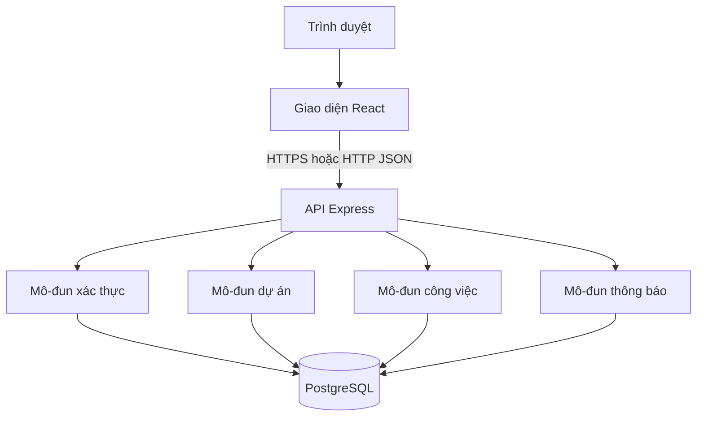
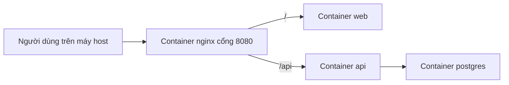
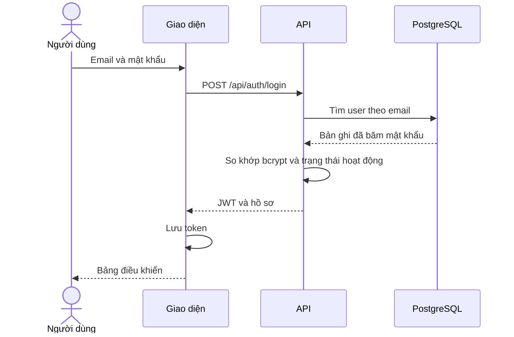
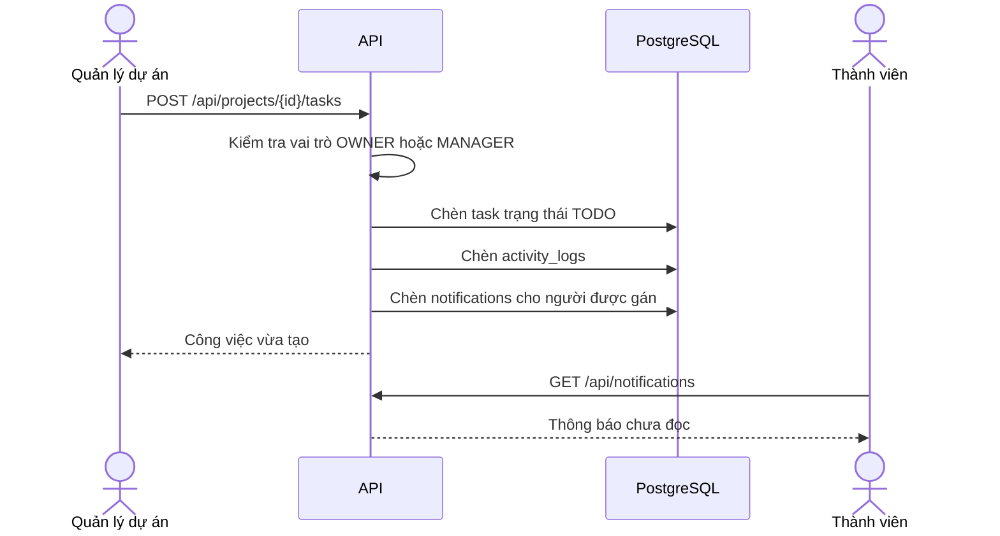

# Thiết kế hệ thống

| Mục | Nội dung |
| --- | --- |
| Hệ thống | PMS-ICTU |
| Phiên bản | 1.0 |
| Liên kết | [SRS](01-srs-dac-ta-yeu-cau.md), [CSDL](04-thiet-ke-csdl.md), [Docker](06-trien-khai-docker.md) |

## 1. Mục tiêu thiết kế

Hệ thống tách ba phần: giao diện web, API nghiệp vụ và cơ sở dữ liệu. Docker Desktop chạy cả ba cùng một reverse proxy. Giao diện không kết nối thẳng tới PostgreSQL. Mọi quyền được kiểm tra tại API.

## 2. Kiến trúc logic



### 2.1. Tầng giao diện

- Trang đăng nhập, đăng ký.
- Khung ứng dụng sau đăng nhập: thanh điều hướng, vùng nội dung, biểu tượng thông báo.
- Trang bảng điều khiển, danh sách dự án, chi tiết dự án, bảng công việc, quản trị người dùng.
- Lưu JWT trong `sessionStorage`. Hết hạn hoặc nhận 401 thì xóa token và về trang đăng nhập.

### 2.2. Tầng API

API theo REST, dữ liệu JSON, mã hóa UTF-8. Một tiến trình Node.js gồm các lớp:

| Lớp | Trách nhiệm |
| --- | --- |
| Router | Ánh xạ đường dẫn và phương thức HTTP |
| Middleware | Đọc JWT, nạp người dùng, chặn tài khoản khóa, ghi log |
| Service | Luật nghiệp vụ, kiểm tra vai trò dự án, ghi nhật ký và thông báo |
| Repository | Câu lệnh SQL tham số hóa tới PostgreSQL |

Service là nơi duy nhất quyết định cho phép hay từ chối thao tác nghiệp vụ.

### 2.3. Tầng dữ liệu

PostgreSQL lưu dữ liệu nghiệp vụ. Khởi tạo lược đồ bằng script SQL chạy khi tạo volume lần đầu. API khi khởi động chỉ tạo tài khoản quản trị hạt giống nếu chưa có quản trị viên.

## 3. Kiến trúc triển khai

Chi tiết cổng, mạng và volume nằm ở [tài liệu Docker](06-trien-khai-docker.md). Nhìn từ phía người dùng:



Giao diện gọi API cùng gốc máy chủ (`/api`), nên trình duyệt không cần cấu hình CORS cho triển khai mặc định.

## 4. Phân rã module

| Module | Đầu vào chính | Đầu ra chính | Phụ thuộc |
| --- | --- | --- | --- |
| auth | Email, mật khẩu, JWT | Token, hồ sơ người dùng | users |
| users | Lệnh quản trị | Danh sách và trạng thái tài khoản | auth, users |
| projects | Thông tin dự án | Dự án và vai trò của người gọi | auth, projects, project_members |
| members | Email, vai trò dự án | Thành viên, thông báo | projects, users, notifications |
| tasks | Nội dung và trạng thái việc | Công việc, nhật ký, thông báo | projects, tasks |
| comments | Nội dung bình luận | Bình luận | tasks |
| activity | Sự kiện từ các service | Dòng nhật ký | activity_logs |
| dashboard | Người dùng hiện tại | Số liệu tổng hợp | projects, tasks |
| notifications | Sự kiện gán việc, mời dự án | Hộp thông báo cá nhân | notifications |

## 5. Luồng xử lý tiêu biểu

### 5.1. Đăng nhập



### 5.2. Tạo công việc và thông báo



### 5.3. Kiểm tra quyền

Với mỗi lời gọi có `{projectId}`:

1. Middleware xác thực JWT và nạp `user.id`, `user.systemRole`.
2. Nếu `systemRole` là `ADMIN`, cho phép các thao tác quản trị đã khai báo.
3. Nếu không, đọc `project_members` theo cặp người dùng và dự án.
4. So khớp vai trò dự án với hành động. Thiếu quyền trả 403 và không đổi dữ liệu.

## 6. Quy tắc nghiệp vụ tập trung

| Mã | Quy tắc |
| --- | --- |
| BR-01 | Email lưu dạng chữ thường |
| BR-02 | Một người chỉ có một vai trò trong một dự án |
| BR-03 | Dự án `COMPLETED` không nhận công việc mới |
| BR-04 | Trạng thái công việc chỉ đi tới bước kề hoặc lùi một bước |
| BR-05 | Gỡ thành viên thì công việc họ đang nhận có `assignee_id` thành null |
| BR-06 | Không khóa quản trị viên cuối cùng và không để quản trị viên tự khóa |
| BR-07 | Xóa dự án xóa thành viên, công việc, bình luận, nhật ký và thông báo gắn với dự án đó |

## 7. Xử lý lỗi

| Tình huống | Mã HTTP | Mã lỗi API |
| --- | --- | --- |
| Thiếu hoặc hết hạn token | 401 | `UNAUTHENTICATED` |
| Đủ đăng nhập nhưng sai vai trò | 403 | `FORBIDDEN` |
| Không tìm thấy tài nguyên hoặc không được biết sự tồn tại | 404 | `NOT_FOUND` |
| Dữ liệu vào không hợp lệ | 422 | `VALIDATION_ERROR` |
| Xung đột dữ liệu, ví dụ email trùng | 409 | `CONFLICT` |
| Lỗi không lường trước | 500 | `INTERNAL_ERROR` |

Thân lỗi có dạng:

```json
{
  "error": {
    "code": "VALIDATION_ERROR",
    "message": "Ngày kết thúc không được trước ngày bắt đầu",
    "fields": { "endDate": "Không hợp lệ" }
  }
}
```

Với đăng nhập sai, thông điệp không cho biết email có tồn tại hay không.

## 8. Bảo mật trong thiết kế

- Mật khẩu băm bcrypt, cost factor 10.
- JWT ký bằng bí mật lấy từ biến môi trường, hạn 8 giờ, gồm `sub` là mã người dùng và `role` hệ thống.
- Câu SQL dùng tham số, không nối chuỗi từ dữ liệu người dùng.
- Nginx chỉ publish cổng 8080. PostgreSQL nằm trên mạng nội bộ của Compose.
- Tài khoản quản trị hạt giống lấy mật khẩu từ biến môi trường, không ghi mật khẩu vào mã nguồn.

## 9. Cấu trúc mã dự kiến

```text
Project-Management-ICTU/
├── docs/
├── apps/
│   ├── web/                 # React + Vite
│   └── api/                 # Express
├── database/
│   └── init/001_schema.sql
├── deploy/
│   ├── nginx.conf
│   └── docker-compose.yml
├── .env.example
└── README.md
```

Cấu trúc này là cam kết của đặc tả để mã nguồn và tài liệu Docker cùng một cách bố trí. Việc hiện thực mã nằm ngoài tài liệu này.
