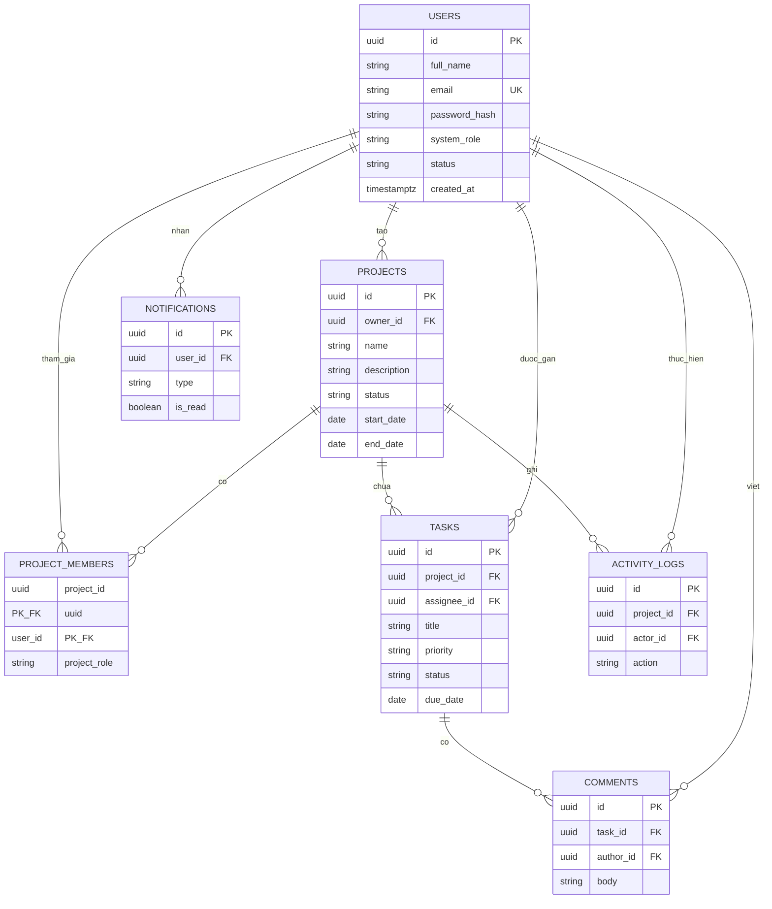

# Thiết kế cơ sở dữ liệu

| Mục | Nội dung |
| --- | --- |
| Hệ thống | PMS-ICTU |
| Phiên bản | 1.0 |
| Hệ quản trị | PostgreSQL 16 |
| Liên kết | [SRS](01-srs-dac-ta-yeu-cau.md), [Thiết kế hệ thống](03-thiet-ke-he-thong.md) |

## 1. Mô hình thực thể

## 2. Quy ước

- Khóa chính kiểu `uuid`, sinh bằng `gen_random_uuid()`.
- Tên bảng và cột dùng `snake_case`.
- Thời điểm dùng `timestamptz`. Ngày nghiệp vụ dùng `date`.
- Xóa dự án dùng xóa dây chuyền với dữ liệu thuộc dự án.
- Xóa người dùng không được phép khi còn là owner của dự án. Các khóa ngoại khác dùng `ON DELETE RESTRICT`, trừ `tasks.assignee_id` dùng `ON DELETE SET NULL`.

## 3. Từ điển dữ liệu

### 3.1. `users`

| Cột | Kiểu | Ràng buộc | Mô tả |
| --- | --- | --- | --- |
| id | uuid | PK | Mã người dùng |
| full_name | varchar(120) | NOT NULL | Họ và tên |
| email | varchar(255) | NOT NULL, UNIQUE | Email đăng nhập, lưu chữ thường |
| password_hash | varchar(255) | NOT NULL | Chuỗi bcrypt |
| system_role | varchar(20) | NOT NULL, CHECK | `ADMIN` hoặc `USER` |
| status | varchar(20) | NOT NULL, CHECK | `ACTIVE` hoặc `LOCKED` |
| must_change_password | boolean | NOT NULL, mặc định false | Bật khi tài khoản vừa được cấp bằng mật khẩu tạm |
| created_at | timestamptz | NOT NULL, mặc định `now()` | Thời điểm tạo |
| updated_at | timestamptz | NOT NULL | Thời điểm sửa gần nhất |

### 3.2. `projects`

| Cột | Kiểu | Ràng buộc | Mô tả |
| --- | --- | --- | --- |
| id | uuid | PK | Mã dự án |
| owner_id | uuid | NOT NULL, FK → users.id | Chủ dự án |
| name | varchar(150) | NOT NULL | Tên dự án |
| description | text | NULL | Mô tả |
| status | varchar(20) | NOT NULL, CHECK | `PLANNING`, `ACTIVE`, `ON_HOLD`, `COMPLETED` |
| start_date | date | NOT NULL | Ngày bắt đầu |
| end_date | date | NOT NULL | Ngày kết thúc dự kiến |
| created_at | timestamptz | NOT NULL | Thời điểm tạo |
| updated_at | timestamptz | NOT NULL | Thời điểm sửa |

Ràng buộc bổ sung: `end_date >= start_date`, `char_length(name) >= 3`.

### 3.3. `project_members`

| Cột | Kiểu | Ràng buộc | Mô tả |
| --- | --- | --- | --- |
| project_id | uuid | PK, FK → projects.id ON DELETE CASCADE | Dự án |
| user_id | uuid | PK, FK → users.id | Thành viên |
| project_role | varchar(20) | NOT NULL, CHECK | `OWNER`, `MANAGER`, `MEMBER` |
| joined_at | timestamptz | NOT NULL | Thời điểm tham gia |

Khóa chính gồm `(project_id, user_id)`. Mỗi dự án có đúng một dòng `OWNER`, được kiểm tra ở tầng service khi chuyển quyền sở hữu. Owner đồng thời có một dòng trong bảng này.

### 3.4. `tasks`

| Cột | Kiểu | Ràng buộc | Mô tả |
| --- | --- | --- | --- |
| id | uuid | PK | Mã công việc |
| project_id | uuid | NOT NULL, FK → projects.id ON DELETE CASCADE | Dự án chứa việc |
| assignee_id | uuid | NULL, FK → users.id ON DELETE SET NULL | Người thực hiện |
| title | varchar(200) | NOT NULL | Tiêu đề, từ 3 ký tự |
| description | text | NULL | Mô tả |
| priority | varchar(20) | NOT NULL, CHECK | `LOW`, `MEDIUM`, `HIGH`, `URGENT` |
| status | varchar(20) | NOT NULL, CHECK | `TODO`, `IN_PROGRESS`, `REVIEW`, `DONE` |
| due_date | date | NULL | Hạn hoàn thành |
| created_by | uuid | NOT NULL, FK → users.id | Người tạo |
| created_at | timestamptz | NOT NULL | Thời điểm tạo |
| updated_at | timestamptz | NOT NULL | Thời điểm sửa |

### 3.5. `comments`

| Cột | Kiểu | Ràng buộc | Mô tả |
| --- | --- | --- | --- |
| id | uuid | PK | Mã bình luận |
| task_id | uuid | NOT NULL, FK → tasks.id ON DELETE CASCADE | Công việc |
| author_id | uuid | NOT NULL, FK → users.id | Người viết |
| body | varchar(2000) | NOT NULL | Nội dung |
| created_at | timestamptz | NOT NULL | Thời điểm gửi |

### 3.6. `activity_logs`

| Cột | Kiểu | Ràng buộc | Mô tả |
| --- | --- | --- | --- |
| id | uuid | PK | Mã nhật ký |
| project_id | uuid | NOT NULL, FK → projects.id ON DELETE CASCADE | Dự án |
| actor_id | uuid | NULL, FK → users.id ON DELETE SET NULL | Người thực hiện |
| action | varchar(50) | NOT NULL | Mã sự kiện |
| metadata | jsonb | NOT NULL, mặc định `{}` | Dữ liệu phụ, ví dụ tên việc, trạng thái cũ và mới |
| created_at | timestamptz | NOT NULL | Thời điểm |

Giá trị `action` dùng trong phiên bản 1.0:

| Mã | Khi nào ghi |
| --- | --- |
| `PROJECT_CREATED` | Tạo dự án |
| `PROJECT_UPDATED` | Sửa thông tin hoặc trạng thái dự án |
| `MEMBER_ADDED` | Thêm thành viên |
| `MEMBER_REMOVED` | Gỡ thành viên |
| `TASK_CREATED` | Tạo công việc |
| `TASK_STATUS_CHANGED` | Đổi trạng thái |
| `TASK_DELETED` | Xóa công việc |

### 3.7. `notifications`

| Cột | Kiểu | Ràng buộc | Mô tả |
| --- | --- | --- | --- |
| id | uuid | PK | Mã thông báo |
| user_id | uuid | NOT NULL, FK → users.id ON DELETE CASCADE | Người nhận |
| type | varchar(40) | NOT NULL | `PROJECT_INVITED`, `TASK_ASSIGNED`, `TASK_STATUS_CHANGED` |
| title | varchar(200) | NOT NULL | Tiêu đề ngắn |
| project_id | uuid | NULL | Dùng để mở đúng dự án |
| task_id | uuid | NULL | Dùng để mở đúng việc |
| is_read | boolean | NOT NULL, mặc định false | Đã đọc hay chưa |
| created_at | timestamptz | NOT NULL | Thời điểm tạo |

`project_id` và `task_id` không đặt khóa ngoại cứng để thông báo còn đọc được sau khi việc hoặc dự án đã xóa. Giao diện nếu không mở được đích thì chỉ hiện nội dung thông báo.

## 4. Chỉ mục

| Chỉ mục | Cột | Mục đích |
| --- | --- | --- |
| `users_email_uidx` | `lower(email)` unique | Đăng nhập và chống trùng email |
| `project_members_user_idx` | `user_id` | Liệt kê dự án của một người |
| `tasks_project_status_idx` | `project_id, status` | Bảng cột và thống kê |
| `tasks_assignee_due_idx` | `assignee_id, due_date` | Việc của tôi và việc sắp hạn |
| `comments_task_idx` | `task_id, created_at` | Luồng bình luận |
| `activity_project_idx` | `project_id, created_at desc` | Nhật ký dự án |
| `notifications_user_idx` | `user_id, is_read, created_at desc` | Hộp thư cá nhân |

## 5. Khối lượng dự kiến cho đồ án

| Bảng | Mức dữ liệu kiểm thử |
| --- | --- |
| users | 50 |
| projects | 100 |
| project_members | 400 |
| tasks | 2.000 |
| comments | 5.000 |
| notifications | 5.000 |

Các mức này tương ứng yêu cầu hiệu năng NFR-01.

## 6. Dữ liệu hạt giống

Khi API khởi động:

- Nếu chưa có dòng `users.system_role = 'ADMIN'`, tạo một tài khoản từ `SEED_ADMIN_EMAIL`, `SEED_ADMIN_PASSWORD`, `SEED_ADMIN_NAME`. Tài khoản này có `must_change_password = false`.
- Không chèn dự án mẫu trong lược đồ gốc. Dữ liệu nghiệp vụ do người dùng tạo khi kiểm thử.

## 7. Ánh xạ sang API

| Bảng | Nhóm API |
| --- | --- |
| users | `/api/auth`, `/api/users` |
| projects, project_members | `/api/projects`, `/api/projects/{id}/members` |
| tasks, comments | `/api/projects/{id}/tasks`, `/api/tasks/{id}/comments` |
| activity_logs | `/api/projects/{id}/activities` |
| notifications | `/api/notifications` |
| tổng hợp tasks, projects | `/api/dashboard` |
