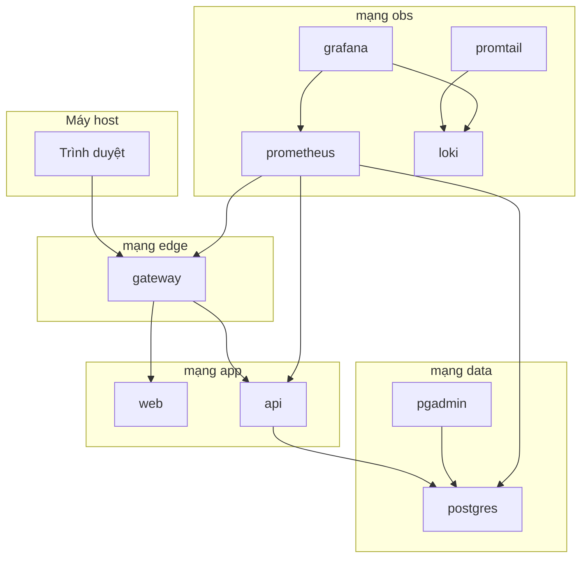

# Triển khai bằng Docker Desktop

| Mục | Nội dung |
| --- | --- |
| Hệ thống | PMS-ICTU |
| Đề | Đề 14, môn Triển khai và Quản trị Hệ thống Phần mềm |
| Phiên bản | 1.1 |
| Công cụ | Docker Desktop, Docker Compose v2 |
| Liên kết | [Yêu cầu đề tài](00-yeu-cau-de-tai.md), [Thiết kế hệ thống](03-thiet-ke-he-thong.md) |

## 1. Mục tiêu triển khai

Toàn bộ hệ thống chạy bằng một file Docker Compose trên Docker Desktop. Máy host không cần cài Node.js, PostgreSQL, Nginx, Prometheus hay Grafana.

Người demo mở website qua Nginx, xem dữ liệu bằng pgAdmin, xem metric bằng Grafana và chạy LogQL trên Loki.

## 2. Yêu cầu máy

| Hạng mục | Mức tối thiểu |
| --- | --- |
| Docker Desktop | Bản còn được hỗ trợ, engine Linux containers đang chạy |
| CPU / RAM cấp cho Docker | 2 CPU, 8 GB RAM |
| Đĩa trống | 10 GB cho image và volume |
| Cổng host còn trống | 8080, 8443, 5050, 3001 |

```bash
docker version
docker compose version
```

## 3. Thành phần

| Dịch vụ | Image / cách dựng | Vai trò | Cổng trên host |
| --- | --- | --- | --- |
| `gateway` | `nginxinc/nginx-unprivileged` | Reverse proxy, security headers, HTTPS tự ký | `8080`, `8443` |
| `web` | Build từ `apps/web` | Giao diện React | Không publish |
| `api` | Build từ `apps/api`, chạy user `node` | REST API, expose `/metrics` | Không publish |
| `postgres` | `postgres:16` | Cơ sở dữ liệu | Không publish |
| `pgadmin` | `dpage/pgadmin4` | Công cụ quản lý PostgreSQL | `127.0.0.1:5050` |
| `prometheus` | `prom/prometheus` | Thu metrics | Không publish |
| `cadvisor` | `gcr.io/cadvisor/cadvisor` | Metrics container | Không publish |
| `postgres-exporter` | `prometheuscommunity/postgres-exporter` | Metrics database | Không publish |
| `nginx-exporter` | `nginx/nginx-prometheus-exporter` | Metrics Nginx | Không publish |
| `grafana` | `grafana/grafana` | Dashboard và cửa sổ LogQL | `127.0.0.1:3001` |
| `loki` | `grafana/loki` | Kho log | Không publish |
| `promtail` | `grafana/promtail` | Đẩy log container vào Loki | Không publish |



`gateway` thuộc cả mạng `edge`, `app` và `obs` để nhận request từ host, chuyển vào ứng dụng và để exporter đọc `stub_status`. `api` thuộc `app` và `data`. `promtail` đọc log Docker trên host qua socket chỉ đọc, rồi đẩy sang Loki trên mạng `obs`.

## 4. Mạng và volume

| Mạng | Dịch vụ được vào | Mục đích |
| --- | --- | --- |
| `edge` | gateway | Ngăn các dịch vụ nội bộ nhận traffic trực tiếp từ host |
| `app` | gateway, web, api | Luồng website và API |
| `data` | api, postgres, pgadmin, postgres-exporter | Database không nằm trên mạng của Grafana |
| `obs` | prometheus, grafana, loki, promtail, cadvisor, nginx-exporter, gateway, api | Giám sát và log |

| Volume | Gắn vào |
| --- | --- |
| `pms_pg_data` | Dữ liệu PostgreSQL |
| `pms_pgadmin_data` | Phiên pgAdmin |
| `pms_prometheus_data` | Dữ liệu metrics |
| `pms_grafana_data` | Dashboard Grafana |
| `pms_loki_data` | Chunk log |

Script `database/init` mount chỉ đọc vào `/docker-entrypoint-initdb.d`. Script chỉ chạy khi volume PostgreSQL còn trống. Script tạo database `pms`, user `pms_app` và chỉ cấp `CONNECT`, `USAGE`, `SELECT`, `INSERT`, `UPDATE`, `DELETE` trên schema ứng dụng. User superuser của image chỉ dùng để khởi tạo và để pgAdmin demo.

## 5. Nginx

`deploy/nginx.conf` làm các việc sau:

- `/` chuyển tới dịch vụ `web`.
- `/api/` chuyển tới `http://api:3000`.
- `/nginx_status` chỉ cho phép IP nội bộ của nginx-exporter, không public ra ngoài location thường.
- Cổng 8080 phục vụ HTTP. Cổng 8443 phục vụ HTTPS bằng chứng chỉ tự ký trong `deploy/certs`.
- Thêm header: `X-Frame-Options: SAMEORIGIN`, `X-Content-Type-Options: nosniff`, `Referrer-Policy: strict-origin-when-cross-origin`, `Content-Security-Policy` mức cơ bản, `Strict-Transport-Security` trên cổng 8443.

Chứng chỉ tự ký được tạo khi dựng, lưu trong thư mục bị gitignore. README ghi lệnh tạo lại chứng chỉ. Trình duyệt sẽ cảnh báo chứng chỉ không tin cậy; đó là kết quả đúng của HTTPS tự ký.

## 6. Giám sát và log

Prometheus scrape:

- `cadvisor` cho CPU, bộ nhớ và trạng thái container.
- `nginx-exporter` cho request của web server.
- `postgres-exporter` cho kết nối và kích thước database.
- `api` tại `/metrics` cho số request ứng dụng.

Grafana được cấp sẵn ba dashboard: Container, Nginx, PostgreSQL. Datasource Prometheus và Loki được khai báo bằng file provisioning, không tạo tay lúc demo.

Promtail gắn nhãn `service` theo tên dịch vụ Compose. Ba câu LogQL bắt buộc nằm ở [yêu cầu đề tài](00-yeu-cau-de-tai.md).

## 7. Biến môi trường

Tệp `.env.example` ở gốc kho. Tệp `.env` không đưa vào git.

| Biến | Dùng ở | Ý nghĩa |
| --- | --- | --- |
| `POSTGRES_DB`, `POSTGRES_USER`, `POSTGRES_PASSWORD` | postgres, pgAdmin | Tài khoản quản trị database cho pgAdmin |
| `PMS_APP_DB_USER`, `PMS_APP_DB_PASSWORD` | script init, api | User hạn chế quyền mà API dùng |
| `DATABASE_URL` | api | Trỏ host `postgres`, user `pms_app` |
| `JWT_SECRET` | api | Khóa ký token, chuỗi dài ngẫu nhiên |
| `PGADMIN_DEFAULT_EMAIL`, `PGADMIN_DEFAULT_PASSWORD` | pgadmin | Đăng nhập pgAdmin |
| `GRAFANA_ADMIN_USER`, `GRAFANA_ADMIN_PASSWORD` | grafana | Đăng nhập Grafana |
| `WEB_PORT`, `WEB_TLS_PORT` | gateway | Mặc định 8080 và 8443 |

Mật khẩu mẫu trong `.env.example` chỉ là chỗ trống. Mật khẩu thật dài ít nhất 12 ký tự.

## 8. Quy trình chạy

```bash
cp .env.example .env
docker compose -f deploy/docker-compose.yml up -d --build
docker compose -f deploy/docker-compose.yml ps
```

Kỳ vọng mọi dịch vụ running. `postgres` và `api` healthy.

| Việc cần kiểm tra | Đường dẫn |
| --- | --- |
| Đăng nhập website | `http://localhost:8080` |
| Header bảo mật | `curl -I http://localhost:8080` |
| HTTPS tự ký | `https://localhost:8443` |
| pgAdmin thấy bảng `projects` | `http://127.0.0.1:5050` |
| Dashboard Grafana | `http://127.0.0.1:3001` |
| LogQL | Grafana Explore, datasource Loki |

Dừng cụm và giữ dữ liệu: `docker compose -f deploy/docker-compose.yml down`.

Xóa dữ liệu khi cố ý dựng lại: `docker compose -f deploy/docker-compose.yml down -v`.

## 9. Tiêu chí nghiệm thu

| Mã | Tiêu chí | Hạng mục thầy chấm |
| --- | --- | --- |
| DEP-01 | `docker compose up -d --build` thành công | Tổng thể |
| DEP-02 | Website mở qua Nginx tại cổng 8080 | Nginx |
| DEP-03 | Response có security headers | Nginx |
| DEP-04 | `https://localhost:8443` trả cùng website bằng chứng chỉ tự ký | Nginx |
| DEP-05 | API health qua `http://localhost:8080/api/health` | Ứng dụng |
| DEP-06 | Đăng nhập, tạo dự án, việc và thành viên | Ứng dụng |
| DEP-07 | pgAdmin kết nối server `postgres` và thấy dữ liệu vừa tạo | Database |
| DEP-08 | Cổng 5432 không mở trên host | Hardening |
| DEP-09 | Grafana có dashboard container, Nginx và PostgreSQL có số liệu | Giám sát |
| DEP-10 | Ba câu LogQL trả kết quả | Log |
| DEP-11 | `api` và `gateway` không chạy bằng root | Hardening |
| DEP-12 | Tắt bằng `down` rồi bật lại, dự án vẫn còn | Database |
| DEP-13 | `.env` không nằm trong git | Hardening |

## 10. Sự cố thường gặp

| Hiện tượng | Hướng xử lý |
| --- | --- |
| Cổng 8080, 8443, 5050 hoặc 3001 bị chiếm | Đổi cổng trong `.env` và ghi URL thật vào báo cáo |
| pgAdmin không nối được database | Host phải là `postgres`, không phải `localhost` |
| Grafana không có dữ liệu | Xem target trên Prometheus qua lệnh trong container, chưa cần publish cổng |
| LogQL trống | Tạo vài request tới website rồi đợi Promtail đẩy log |
| Trình duyệt chặn HTTPS | Chọn tiếp tục với chứng chỉ tự ký, hoặc demo HTTP kèm security headers |
| Sửa SQL mà bảng không đổi | Volume đã khởi tạo. Chỉ dùng `down -v` khi được phép xóa dữ liệu |
